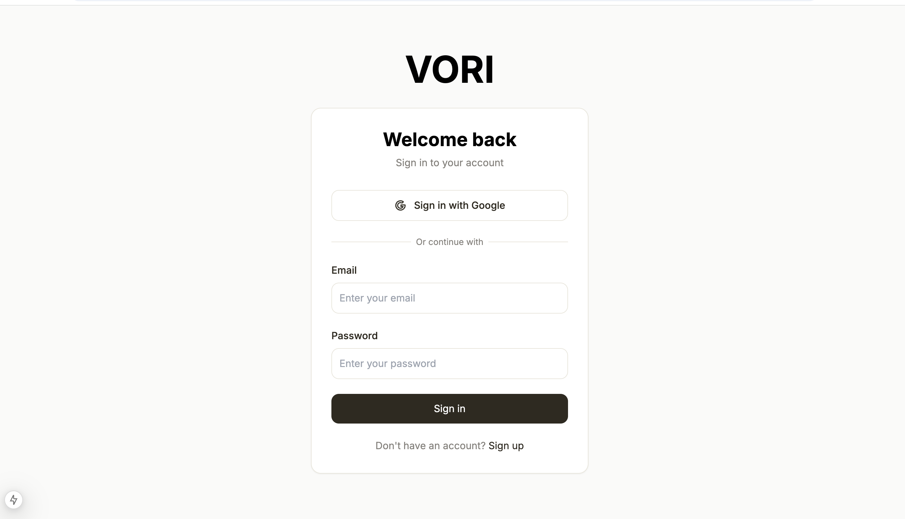
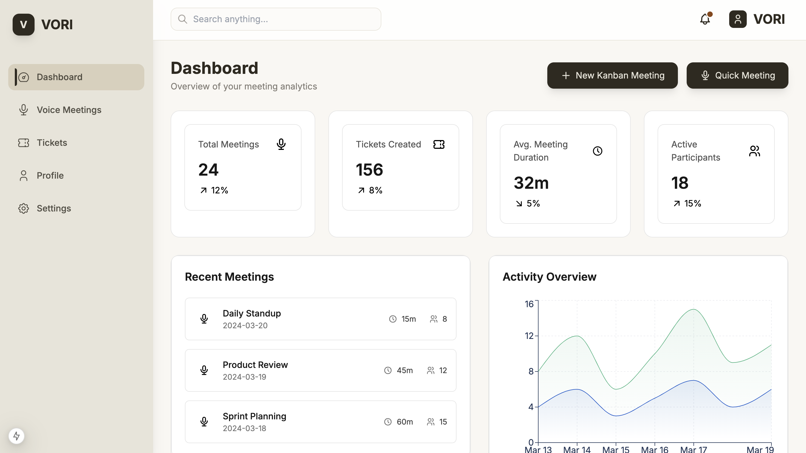
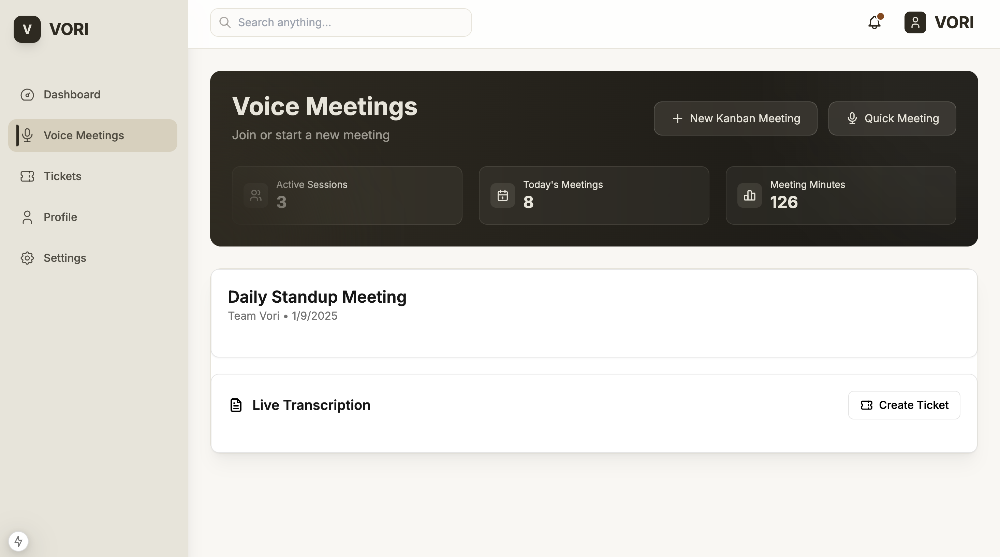
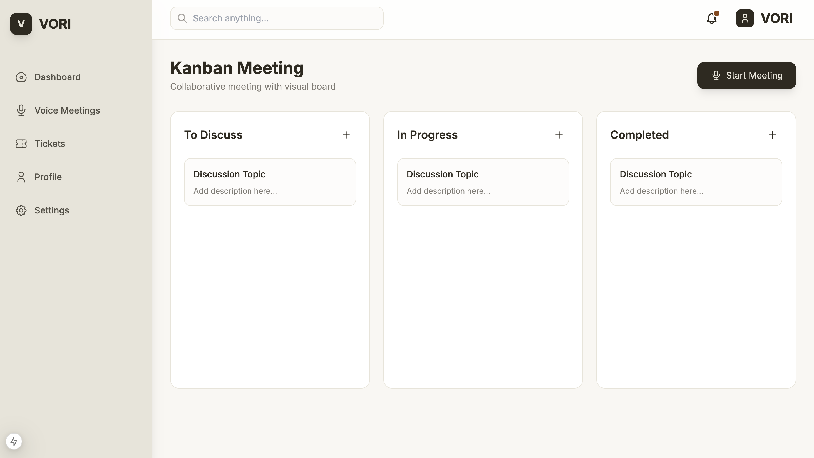
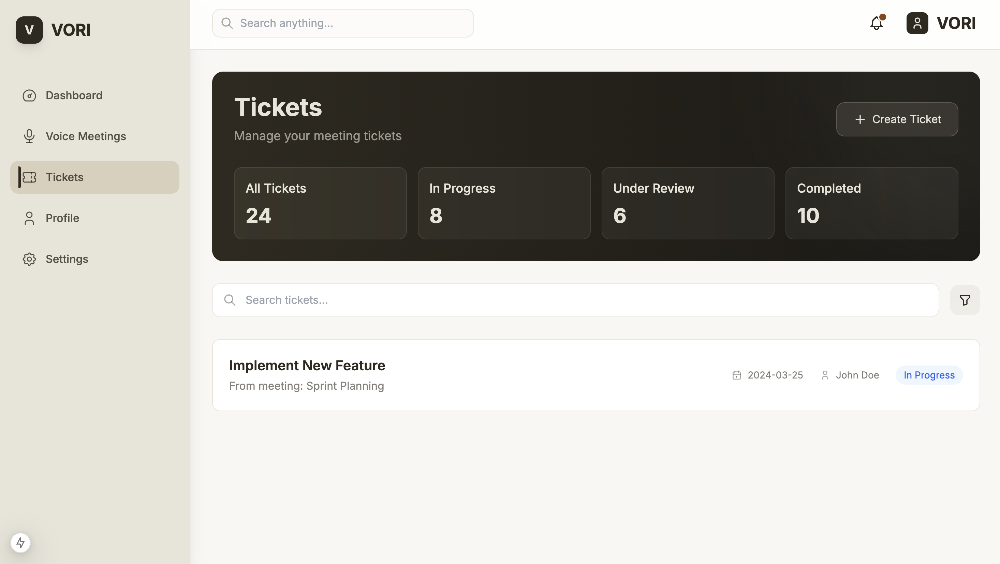
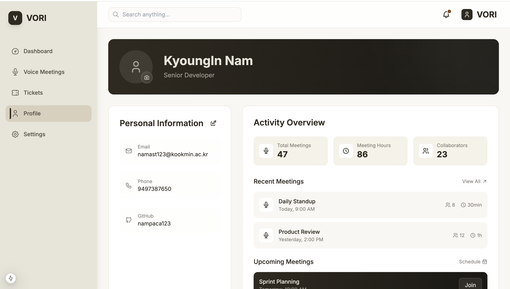
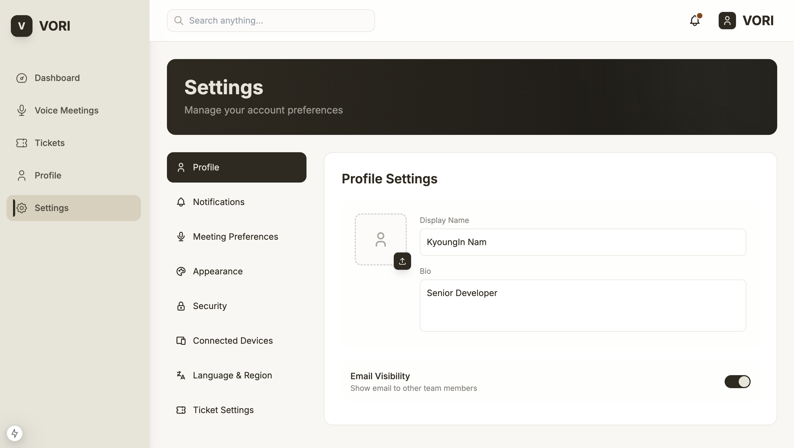
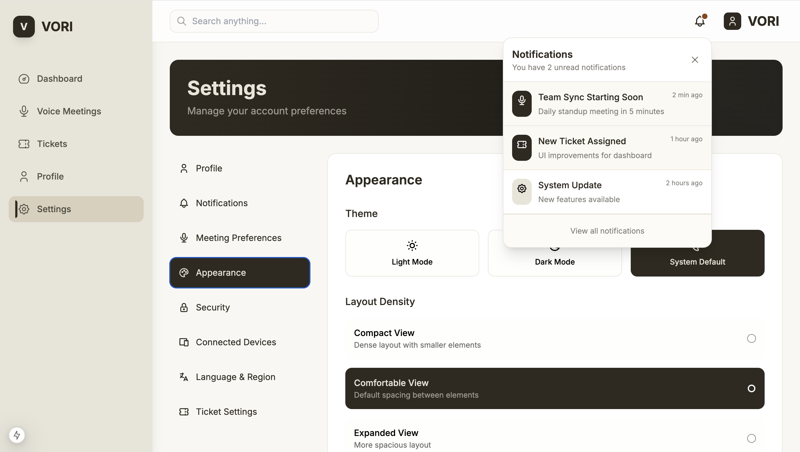
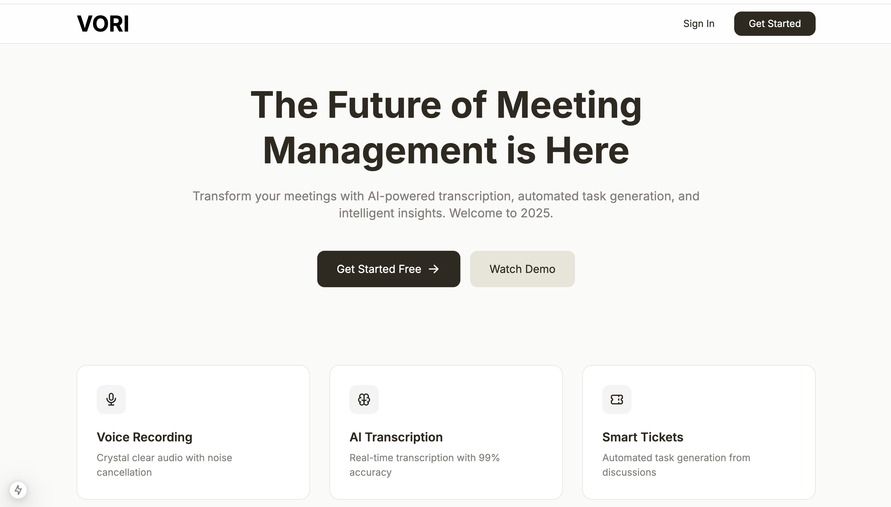

<div align="center">
  
  
  # VORI - The Future of Meeting Management
  
  [](https://nextjs.org/)
  [](https://www.typescriptlang.org/)
  [](https://tailwindcss.com/)
  [](https://www.framer.com/motion/)
</div>

## 🚀 Features

- **🎙️ Voice Recording** - Crystal clear audio with noise cancellation
- **🧠 AI Transcription** - Real-time transcription with 99% accuracy
- **🎫 Smart Tickets** - Automated task generation from discussions
- **💻 Cross-Platform** - Work seamlessly across all your devices
- **📊 Analytics** - Deep insights into meeting productivity
- **🚀 Instant Deploy** - Set up in minutes, not hours

## 📸 Product Tour

<div align="center">
  <div style="display: flex; flex-direction: row; gap: 20px; margin-bottom: 40px;">
    <div style="flex: 1;">
      
      <p><em>Secure Authentication</em></p>
    </div>
    <div style="flex: 1;">
      
      <p><em>AI-Powered Dashboard</em></p>
    </div>
    <div style="flex: 1;">
      
      <p><em>Real-time Meeting Room</em></p>
    </div>
  </div>

  <div style="display: flex; flex-direction: row; gap: 20px; margin-bottom: 40px;">
    <div style="flex: 1;">
      
      <p><em>Visual Kanban Board</em></p>
    </div>
    <div style="flex: 1;">
      
      <p><em>Smart Ticket System</em></p>
    </div>
    <div style="flex: 1;">
      
      <p><em>Personalized Profile</em></p>
    </div>
  </div>

  <div style="display: flex; flex-direction: row; gap: 20px;">
    <div style="flex: 1;">
      
      <p><em>Custom Settings</em></p>
    </div>
    <div style="flex: 1;">
      
      <p><em>Real-time Notifications</em></p>
    </div>
    <div style="flex: 1;">
      
      <p><em>Modern Landing Page</em></p>
    </div>
  </div>
</div>

## 🛠️ Tech Stack

- **Frontend Framework:** Next.js 14 with App Router
- **Styling:** Tailwind CSS with Custom Design System
- **Animations:** Framer Motion
- **State Management:** React Context + Hooks
- **Icons:** Tabler Icons
- **Code Quality:** TypeScript, ESLint, Prettier

## 🚀 Quick Start

1. **Clone the repository**

```bash
git clone https://github.com/nukktae/VoriReborn-Frontend.git
```

2. **Install dependencies**

```bash
cd VoriReborn-Frontend
npm install
```

3. **Start the development server**

```bash
npm run dev
```

4. **Open [http://localhost:3000](http://localhost:3000)**

## 🌟 Key Features

### AI-Powered Meeting Management
- Real-time transcription
- Automated task generation
- Meeting analytics and insights

### Modern User Interface
- Responsive design
- Smooth animations
- Dark/Light mode support

### Enterprise-Ready
- Role-based access control
- Team collaboration features
- Custom integrations

## 📱 Responsive Design

<div align="center">
  
  <p><em>Seamless Experience Across All Devices</em></p>
</div>

## 🤝 Contributing

We welcome contributions! Please see our [Contributing Guide](CONTRIBUTING.md) for details.

## 📄 License

This project is licensed under the MIT License - see the [LICENSE](LICENSE) file for details.

## 🌟 Star History

[](https://star-history.com/#nukktae/VoriReborn-Frontend&Date)

---

<div align="center">
  <p>Built with ❤️ by the VORI team</p>
  <p>
    <a href="https://twitter.com/vori">Twitter</a> •
    <a href="https://discord.gg/vori">Discord</a> •
    <a href="https://vori.com">Website</a>
  </p>
</div>
